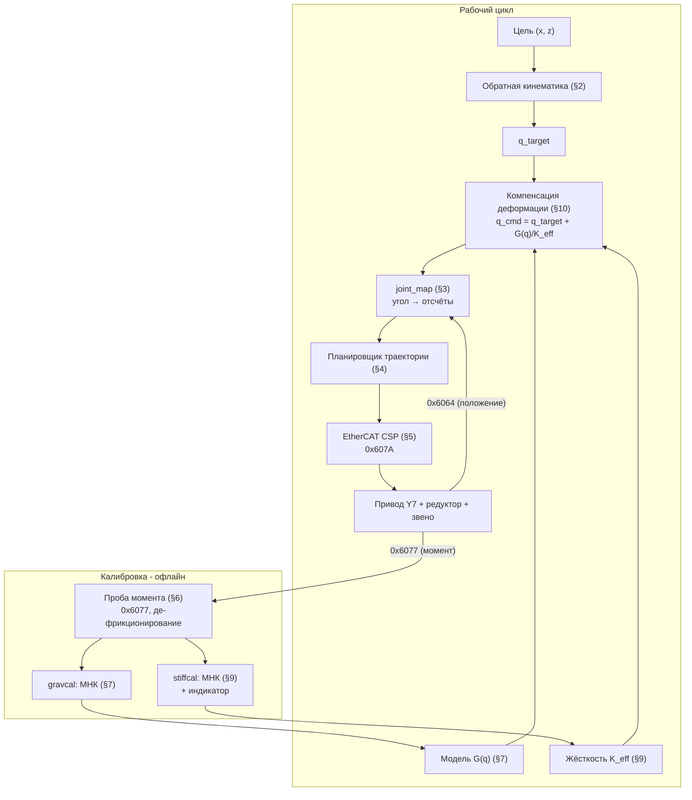
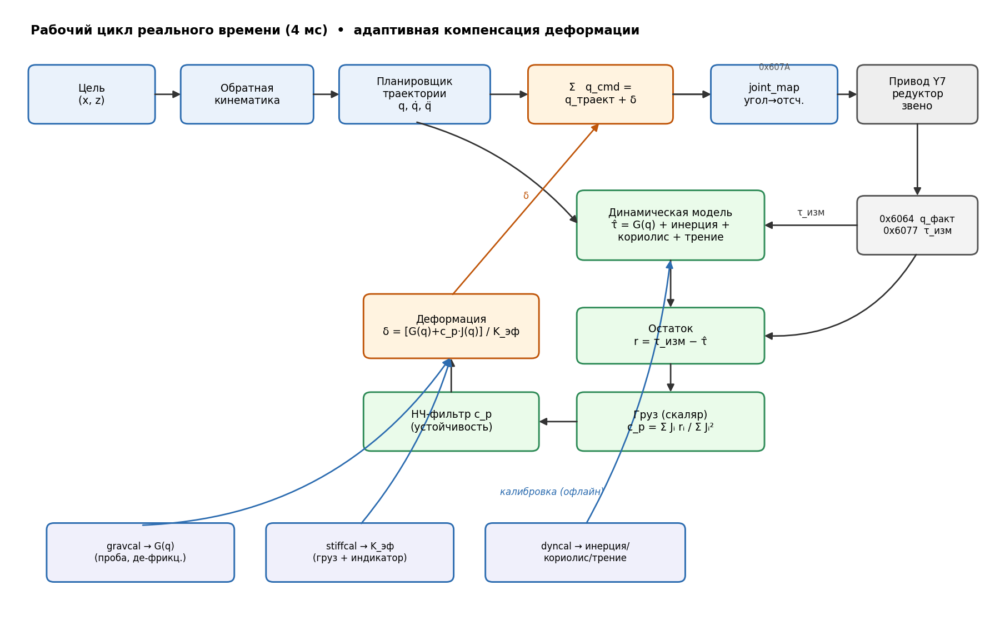
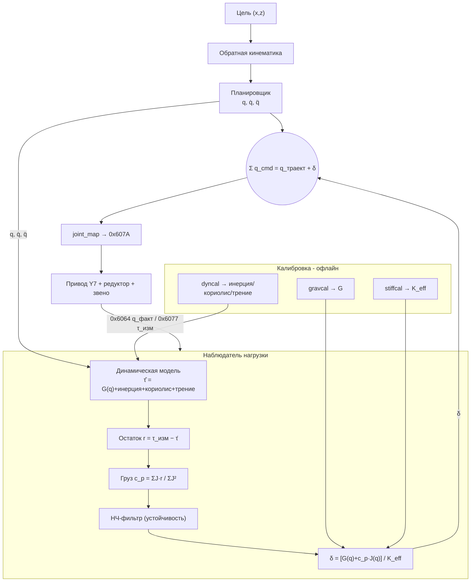
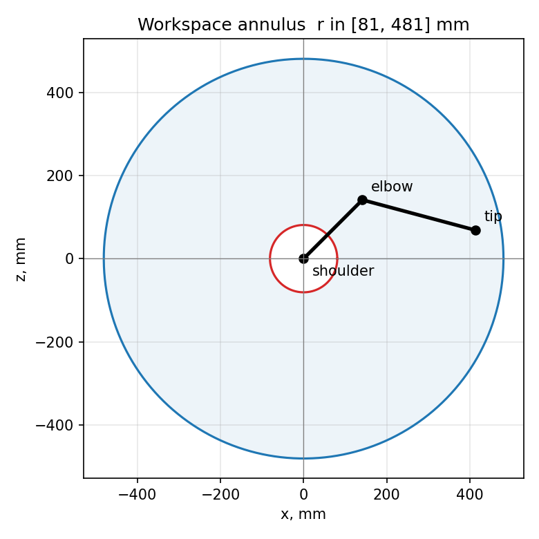
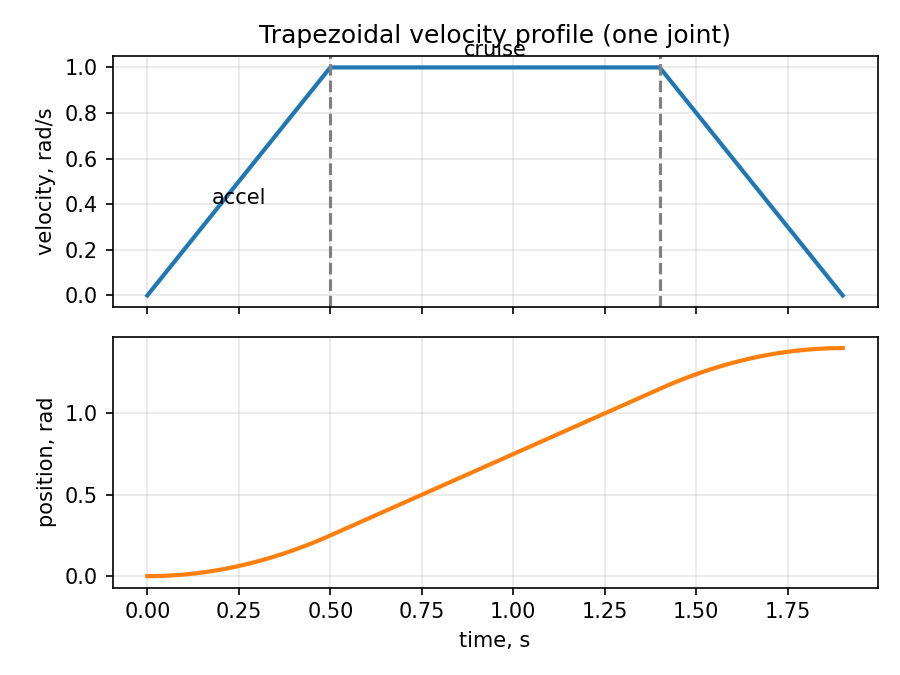
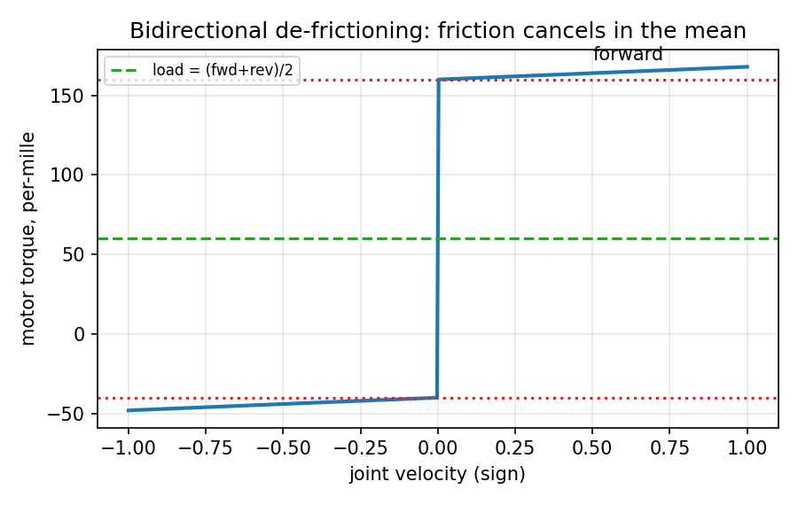
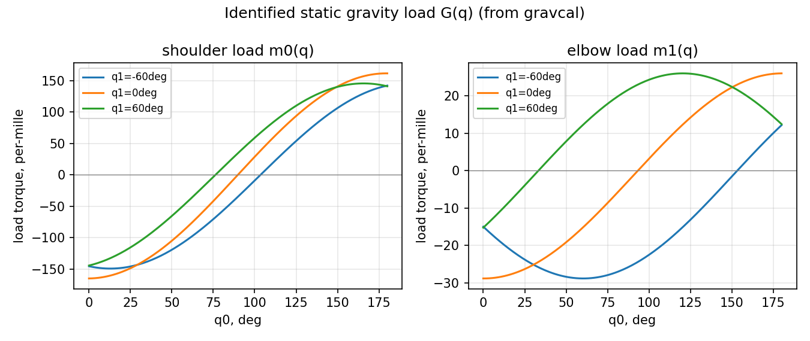
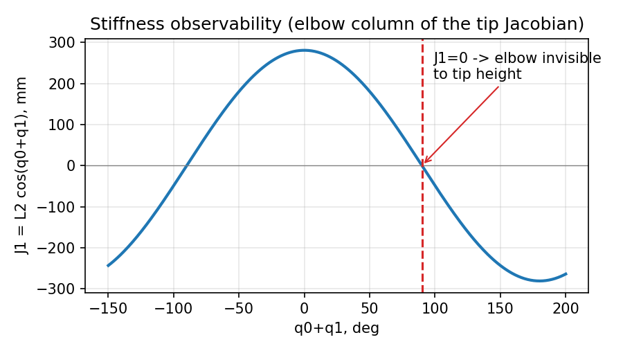
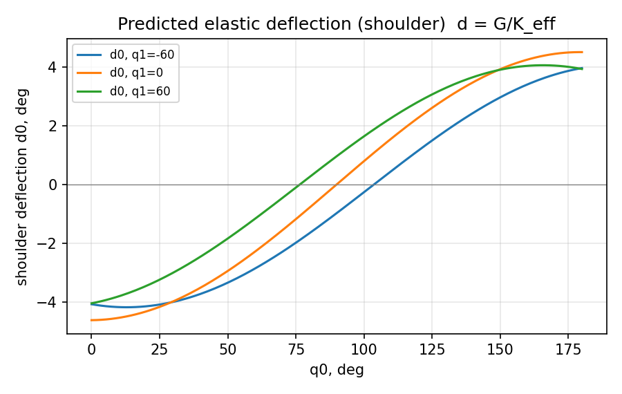

# Алгоритм управления манипулятором с компенсацией упругой деформации

Документ описывает математику и устройство системы управления двухзвенным
плоским манипулятором (плечо + предплечье), приводы которого — сервомоторы
HCFA Y7 с волновыми редукторами, управляемые по шине EtherCAT. Ключевая
особенность системы — компенсация упругой деформации звеньев и редукторов под
нагрузкой по обратной связи момента двигателей, при наличии **только**
моторного энкодера (датчика на выходном звене нет).

Обозначения:
- q = (q₀, q₁) — углы суставов (плечо, локоть), рад;
- L₁, L₂ — длины звеньев, мм;
- N = (N₀, N₁) — передаточные числа редукторов (мотор/сустав);
- τ — момент; всё, что измеряется драйвером, выражено в **тысячных долях
  номинального момента двигателя** (‰), это единицы объекта 0x6077.

---

## 1. Общая постановка и архитектура

Система решает задачу позиционирования рабочего органа в декартовых
координатах (x, z) в вертикальной плоскости. Цепочка преобразований:

```
(x, z)  ──IK──▶  q_target  ──компенсация──▶  q_cmd  ──joint_map──▶  counts  ──CSP──▶ привод
```

Блок-схема рабочего цикла и калибровочных ветвей (Mermaid):



Принципиальная проблема: звенья напечатаны на 3D-принтере (низкий модуль
упругости), редукторы имеют конечную крутильную жёсткость. Под действием силы
тяжести и полезной нагрузки конструкция упруго деформируется, и рабочий орган
отклоняется от заданной точки. Поскольку датчик стоит **только на валу
двигателя**, деформацию нельзя измерить напрямую — её приходится
**оценивать по модели**, а вход для модели даёт обратная связь по моменту
двигателя (0x6077).

Архитектурное решение: компенсация реализована как **feedforward (упреждение)
от модели**, а не как замкнутая обратная связь по моменту. Причины:

1. На нулевой/малой скорости измеренный момент содержит большую полосу
   неопределённости из-за трения редуктора (см. §6), и замыкание
   высокоусиленной петли «момент → положение» неустойчиво.
2. Модель статической нагрузки G(q) даёт гладкую, бесшумную оценку нагрузки в
   каждой позе.

Поэтому измеренный момент используется только эпизодически — для
**идентификации** моделей (калибровки), а в рабочем цикле поправка считается
по модели.

Допущение **квазистатики**: компенсируется деформация под действием силы
тяжести и полезной нагрузки (статические члены). Динамические члены
(инерционные, кориолисовы) не компенсируются — движения выполняются достаточно
медленно, чтобы ими можно было пренебречь.

---

### Итоговый алгоритм с адаптивным наблюдателем нагрузки

Полная схема рабочего цикла реального времени (4 мс) с непрерывной адаптивной
компенсацией: измеренный момент `0x6077` де-инерционируется и
де-фрикционируется по динамической модели, остаток даёт текущую нагрузку
(включая неизвестный груз), из неё считается поправка δ, добавляемая к
траектории.



*Рис. 0. Итоговый алгоритм: верх — конвейер реального времени; центр —
наблюдатель нагрузки (динамическая модель → остаток → груз c_p → фильтр →
деформация δ); низ — офлайн-калибровки, питающие модели.*



## 2. Прямая и обратная кинематика

### 2.1 Прямая кинематика (FK)

Начало координат — в оси плеча; ось X горизонтальна (вперёд +), ось Z
вертикальна (вверх +). q₀ отсчитывается от +X, q₁ — относительно первого звена.

Положение локтя:

    x_e = L₁·cos q₀
    z_e = L₁·sin q₀

Положение рабочего органа (кончика):

    x = L₁·cos q₀ + L₂·cos(q₀ + q₁)
    z = L₁·sin q₀ + L₂·sin(q₀ + q₁)                                   (2.1)

### 2.2 Обратная кинематика (IK)

Дано (x, z), ищем (q₀, q₁). Пусть r² = x² + z². По теореме косинусов:

    cos q₁ = (r² − L₁² − L₂²) / (2·L₁·L₂)                             (2.2)

Условие достижимости: |L₁ − L₂| ≤ r ≤ L₁ + L₂ (точка в кольце рабочей зоны).
Два решения («локоть вверх/вниз») задаются знаком:

    q₁ = ± arccos( cos q₁ )                                          (2.3)

    q₀ = atan2(z, x) − atan2( L₂·sin q₁ , L₁ + L₂·cos q₁ )           (2.4)

Выбор ветви (знак q₁) определяет конфигурацию локтя; программно проверяется
попадание в программные пределы суставов.



*Рис. 1. Кольцевая рабочая зона r ∈ [|L₁−L₂|, L₁+L₂] и пример позы
(плечо–локоть–кончик).*

---

## 3. Преобразование «угол сустава ↔ отсчёты энкодера»

Угол сустава передаётся на двигатель через волновой редуктор с передаточным
числом Nᵢ, драйвер считает CPR отсчётов энкодера на оборот вала двигателя.
Электронный редуктор драйвера (0x6091) равен 1:1, поэтому отсчёты — «сырые»
моторные, а редукцию учитываем в ПО:

    counts_i = home_i + dir_i · (q_i − q0_i)/(2π) · N_i · CPR         (3.1)

и обратно

    q_i = q0_i + dir_i · (counts_i − home_i) / (N_i · CPR) · 2π       (3.2)

где:
- dir_i ∈ {+1, −1} — знак, согласующий математический фрейм с физическим
  направлением вращения (определяется при калибровке);
- home_i — отсчёт энкодера в нулевой позе сустава q0_i (абсолютный энкодер
  выдаёт произвольное число при включении, поэтому home захватывается при
  процедуре «home»);
- N_i·CPR — число отсчётов на полный оборот **сустава**.

Калиброванные значения для данного стенда: CPR = 2²³ = 8 388 608 (подтверждено
тестом «один оборот вала»); N = (50, 100) (подтверждено тестом «повернуть на
заданный угол»: при номинале редукторов 100/200 сустав поворачивался ровно
вдвое больше, т.е. реальная редукция вдвое меньше — нескомпенсированная
ступень 2:1); dir = (−1, −1) (выбрано так, чтобы +Z математического фрейма
соответствовал движению кончика вверх).

---

## 4. Планирование траектории (синхронизированная трапеция)

Движение в суставном пространстве по симметричному трапецеидальному профилю
скорости (разгон — крейсер — торможение). Для расстояния d ≥ 0 при пределах
скорости v_max и ускорения a_max минимальное время:

    d_ramp = v_max² / a_max
    если d ≤ d_ramp:  T = 2·√(d / a_max)              (треугольный профиль)
    иначе:            T = d / v_max + v_max / a_max    (трапеция)            (4.1)

**Синхронизация осей:** для каждого сустава считается своё минимальное время по
(4.1); общее время хода T = максимум по суставам. Остальные суставы замедляются
так, чтобы финишировать одновременно. Для заданного T крейсерская скорость
сустава находится из условия d = v·T − v²/a:

    v = ( a·T − √( (a·T)² − 4·a·d ) ) / 2                              (4.2)

Профиль положения (t_a = v/a — время разгона):

    s(t) = ½·a·t²                          0 ≤ t < t_a
         = ½·a·t_a² + v·(t − t_a)          t_a ≤ t < T − t_a
         = d − ½·a·(T − t)²                T − t_a ≤ t ≤ T              (4.3)

Траектория дискретизируется с шагом цикла шины (4 мс), каждая выборка
переводится в отсчёты по (3.1) и потоково отправляется в привод.



*Рис. 2. Трапецеидальный профиль скорости (вверху) и соответствующее положение
(внизу) для одного сустава; пунктир — границы фаз разгона/торможения.*

---

## 5. Шинный уровень: Cyclic Synchronous Position (CSP)

Приводы работают в режиме CiA 402 mode 8 (CSP): хост в каждом цикле (4 мс)
задаёт целевое положение (объект 0x607A), драйвер его отрабатывает; фактическое
положение читается из 0x6064, момент — из 0x6077. Реализованы защиты:

- **Захват цели при включении**: при переходе в OPERATION_ENABLED целевое
  положение приравнивается к текущему фактическому (0x6064), иначе привод
  рванёт к нулю.
- **Ограничение скорости нарастания** (slew): поток ведёт цель к заданной точке
  не быстрее заданного предела — резкий скачок цели в CSP невозможен.
- **Ограничение момента**: на Y7 действующим ограничителем являются объекты
  0x60E0/0x60E1 (а не 0x6072), в тех же единицах ‰; задаётся при инициализации.

---

## 6. Измерение момента, разложение и устранение трения

Измеряемый драйвером момент двигателя (0x6077, в ‰) уравновешивает сумму
составляющих, приведённых к валу мотора через редукцию N и КПД η:

    τ_motor·N·η = τ_инерц(q,q̈) + τ_кориолис(q,q̇) + τ_грав(q)
                  + τ_payload + τ_трен(q̇, нагрузка)                    (6.1)

В квазистатике (q̇ ≈ 0, q̈ ≈ 0) инерционные и кориолисовы члены обнуляются, и
остаётся **статическая нагрузка** плюс **трение**:

    τ_motor·N·η ≈ τ_load + τ_трен,   где   τ_load = τ_грав + τ_payload  (6.2)

### 6.1 Проблема трения волнового редуктора

Трение волнового редуктора велико (на данном стенде ≈ 10 % номинала на плече,
≈ 5 % на локте) и зависит от направления движения. При **нулевой** скорости
момент удержания может лежать в любой точке полосы ±τ_трен, поэтому оценка
нагрузки по удержанию неоднозначна на всю ширину этой полосы.

### 6.2 Устранение трения двунаправленным усреднением

Трение — нечётная функция скорости (меняет знак с направлением), а нагрузка от
этого не зависит. Поэтому одну и ту же позу проходят медленно «туда» и
«обратно» на постоянной малой скорости и усредняют момент:

    τ_load   = ( τ_вперёд + τ_назад ) / 2                              (6.3)
    τ_трен   = ( τ_вперёд − τ_назад ) / 2                              (6.4)

В (6.3) кулоновское и вязкое трение (оба нечётные по скорости) взаимно
сокращаются, давая чистую нагрузку. (6.4) попутно даёт оценку трения. На стенде
эта процедура реализована как «проба» (probe): медленный свип ±Δ на постоянной
скорости, усреднение момента по участку постоянной скорости.



*Рис. 3. Момент двигателя как функция направления движения: кулоновское трение
сдвигает кривую на ±τ_трен; среднее «вперёд/назад» (пунктир) возвращает чистую
нагрузку.*

---

## 7. Идентификация модели статической нагрузки G(q)

Цель — построить функцию G(q), предсказывающую статический момент нагрузки в
каждом суставе по позе, без обращения к шумному живому моменту в рабочем цикле.

### 7.1 Физический вид

Момент силы тяжести в суставе i равен сумме моментов весов всех масс,
расположенных дистальнее сустава, на их **горизонтальные** плечи (так как сила
тяжести вертикальна):

    τ_грав,i = g · Σ_k m_k · x_k(q)                                    (7.1)

где x_k — горизонтальная координата массы k относительно оси сустава i.
Подставляя горизонтальные координаты центров масс звеньев из (2.1), получаем,
что момент в плече и локте раскладывается на гармоники углов:

    τ_грав,0 = A·cos q₀ + B·cos(q₀ + q₁)                              (7.2)
    τ_грав,1 =            B·cos(q₀ + q₁)                              (7.3)

где A объединяет момент звена 1 и всего, что за плечом (∝ cos q₀), а B —
момент звена 2 и нагрузки (∝ cos(q₀+q₁)).

### 7.2 Рабочая (идентифицируемая) форма

Чтобы (а) учесть возможное смещение центра масс от оси звена (даёт члены sin) и
(б) поглотить постоянное смещение датчика, и (в) **остаться в единицах момента
мотора (‰)** — модель строится линейной по параметрам, отдельно для каждой оси:

    m₀(q) = c₀₀·cos q₀ + c₀₁·sin q₀ + c₀₂·cos(q₀+q₁) + c₀₃·sin(q₀+q₁) + c₀₄   (7.4)
    m₁(q) = c₁₀·cos(q₀+q₁) + c₁₁·sin(q₀+q₁) + c₁₂                              (7.5)

**Почему в ‰, по каждой оси отдельно.** Если подгонять модель прямо под
измеренный момент мотора, то неизвестные N, η и масштаб «‰ на Н·мм» автоматически
сворачиваются в коэффициенты cᵢⱼ. При этом каждая ось остаётся в **своих**
моторных единицах, и оси не нужно сводить между собой — это критично для
согласованности с компенсацией (см. §9, §10).

### 7.3 Метод наименьших квадратов

Собирается набор поз q⁽ᵏ⁾; в каждой пробой (6.3) измеряется чистая нагрузка
τ_load⁽ᵏ⁾ по обеим осям. Для каждой оси j формируется задача МНК:

    Φⱼ · cⱼ = yⱼ                                                       (7.6)

где строка матрицы Φⱼ — значения базисных функций (7.4)/(7.5) в позе q⁽ᵏ⁾, yⱼ —
измеренные нагрузки. Решение cⱼ = (Φⱼᵀ Φⱼ)⁻¹ Φⱼᵀ yⱼ.

**Сбор данных (gravcal):** манипулятор автономно объезжает сетку безопасных поз
(в пределах суставов и выше декартова «пола», чтобы не задеть стол), в каждой
делает пробу, копит (q, τ_load), затем решает (7.6). Качество оценивается по
СКО остатка. На стенде получено СКО ≈ 1 ‰ на диапазоне нагрузок ±164 ‰ —
модель идентифицируется очень точно.



*Рис. 4. Идентифицированный статический момент нагрузки G(q): плечо (слева,
размах ≈ ±160 ‰) и локоть (справа, ≈ ±29 ‰) как функция q₀ при нескольких q₁.
Косинусоидальная форма соответствует (7.2)–(7.3).*

---

## 8. Модель упругой деформации

Между валом двигателя и выходным звеном — упругий элемент (крутильная
податливость редуктора + изгиб печатного звена), который моделируется как
**линейная крутильная пружина с эффективной (лумпированной) жёсткостью K_eff,i**
на сустав. Под моментом нагрузки τ_load элемент закручивается:

    θ_link = θ_motor − τ_load / K_eff                                  (8.1)

То есть выходное звено «отстаёт» от вала на величину деформации δ = τ_load/K_eff
в направлении нагрузки. Поскольку датчик меряет θ_motor, эта деформация невидима
напрямую и оценивается через (8.1).

«Лумпированная» жёсткость означает, что крутильная податливость редуктора и
распределённый изгиб звена объединены в один эффективный коэффициент на сустав,
который калибруется по измеренному прогибу кончика.

---

## 9. Идентификация жёсткости K_eff (разделение осей при индикаторе только на кончике)

Деформацию нельзя измерить моторным энкодером, поэтому используется **внешняя
метрология** — часовой индикатор. Ограничение стенда: индикатор крепится только
к **кончику** манипулятора, а деформируются **обе** оси. Ниже — метод
разделения K_eff обеих осей по замерам прогиба только кончика.

### 9.1 Связь прогиба кончика с деформациями суставов

Вертикальный прогиб кончика складывается из деформаций обоих суставов через
якобиан кончика по Z:

    Δz_кончика = J₀·δ₀ + J₁·δ₁                                         (9.1)

где якобианы — частные производные высоты кончика z по углам суставов из (2.1):

    J₀ = ∂z/∂q₀ = L₁·cos q₀ + L₂·cos(q₀+q₁) = x_кончика                (9.2)
    J₁ = ∂z/∂q₁ = L₂·cos(q₀+q₁) = горизонт. вылет «локоть→кончик»      (9.3)

(Примечательно: ∂z/∂q₀ численно равен горизонтальной координате кончика.)

### 9.2 Известная нагрузка и линейная регрессия

На кончик надевается груз известной массы (повторяемый прирост нагрузки). Он
добавляет к каждой оси прирост нагрузки Δmᵢ (измеряемый пробой как разность
«нагрузка с грузом» − G(q)), и вызывает деформацию δᵢ = Δmᵢ/Kᵢ. Подставляя в
(9.1):

    Δz = J₀·(Δm₀/K₀) + J₁·(Δm₁/K₁)
       = (J₀·Δm₀)·(1/K₀) + (J₁·Δm₁)·(1/K₁)                            (9.4)

Уравнение **линейно по (1/K₀, 1/K₁)**. В разных позах коэффициенты J₀, J₁, Δm
весят оси по-разному, поэтому по нескольким позам МНК **разделяет** обе
жёсткости, хотя измеряется только прогиб кончика. Минимум 2 позы, для
устойчивости — 4–6.

Всё держится в ‰ (как и G(q)): Δmᵢ — приращение в ‰ из пробы, поэтому
получаемые Kᵢ — в **‰/рад**, что напрямую стыкуется с компенсацией.

### 9.3 Наблюдаемость и подбор поз

Разделение осей возможно только если столбцы матрицы регрессии (9.4) — векторы
(J₀·Δm₀)⁽ᵏ⁾ и (J₁·Δm₁)⁽ᵏ⁾ по позам — линейно независимы. Критическая ошибка:
позы с q₀+q₁ = 90°, где J₁ = L₂·cos 90° = 0 — в них локоть **не влияет** на
высоту кончика и не несёт информации о K₁. Поэтому позы подбираются
автоматически так, чтобы **максимизировать минимальное сингулярное число**
нормированной по столбцам матрицы якобианов — это гарантирует наблюдаемость
обеих осей и обусловленность задачи.



*Рис. 5. Столбец локтя в якобиане кончика J₁ = L₂·cos(q₀+q₁) обращается в ноль
при q₀+q₁ = 90°. Позы вблизи этого значения не несут информации о K₁ — их надо
исключать при подборе поз для stiffcal.*

**Сбор данных (stiffcal):** для каждой подобранной позы — подъезд, обнуление
индикатора без груза, надевание груза, проба «с грузом» (малый свип, чтобы
маленький диапазон индикатора не выбило), считывание прогиба, снятие груза.
Затем решается (9.4).

---

## 10. Компенсация деформации (рабочий цикл)

Имея G(q) (§7) и K_eff (§9), на каждое целевое движение считается упреждающая
поправка к командному углу.

Предсказанная деформация сустава в целевой позе:

    δᵢ(q_target) = Gᵢ(q_target) / K_eff,i                             (10.1)

Из модели пружины (8.1): чтобы **звено** оказалось в q_target, вал двигателя
надо вывести «дальше» на величину деформации:

    θ_link = θ_motor − τ_load/K   ⇒   θ_motor = q_target + δ
    ⇒  q_cmd = q_target + δ(q_target)                                 (10.2)

Командный угол (10.2) переводится в отсчёты по (3.1) и отрабатывается в CSP.
Поскольку поправка мала, момент пересчитывается в исходной целевой позе
(итерация по позе не требуется).

Свойства:
- Это **упреждение от модели**: живой момент в этот путь не входит, поэтому
  полоса трения ±100 ‰ не вносит шум и петля устойчива.
- Согласованность знаков: G и K_eff получены в одной и той же конвенции
  (‰ и dir), поэтому δ = G/K имеет правильный знак. Знак подлежит проверке на
  стенде: при включённой компенсации прогиб кончика в нагруженной позе должен
  **уменьшаться**; если растёт — знак инвертирован.
- Если жёсткость какой-то оси не идентифицирована (Kᵢ отсутствует), её поправка
  принимается равной нулю (деформация этой оси не компенсируется).



*Рис. 6. Предсказанная упругая деформация плеча δ₀ = G₀(q)/K_eff,0 (в градусах)
как функция позы — величина упреждающей поправки, добавляемой к командному углу.*

---

## 11. Сводка калибровочного конвейера

| Этап | Что измеряется | Что даёт | Единицы |
|------|----------------|----------|---------|
| Направление/редукция | тесты «оборот», «угол» | dir, N, CPR | — |
| Home | поза = q₀ нулевой | home_counts | отсчёты |
| gravcal | проба по сетке поз | коэффициенты G(q) | ‰ |
| (попутно) | проба | трение τ_трен | ‰ |
| stiffcal | прогиб кончика под грузом | K_eff | ‰/рад |

В рабочем цикле: (x,z) → IK (2.2–2.4) → q_target → поправка (10.1)–(10.2) →
q_cmd → отсчёты (3.1) → CSP.

---

## 12. Допущения и ограничения

1. **Квазистатика**: компенсируются только статические члены (гравитация +
   нагрузка); инерционные/кориолисовы не учитываются → движения медленные.
2. **Линейная жёсткость**: δ ∝ τ; справедливо при малых деформациях. Для
   печатных полимерных звеньев возможны вязкоупругость и ползучесть (зависимость
   от времени и температуры) — в текущей модели не учтены.
3. **Только моторный энкодер**: деформация не измеряется в реальном времени, а
   оценивается по модели — точность компенсации ограничена качеством
   калибровки G(q) и K_eff.
4. **Лумпированная модель на сустав**: распределённый изгиб звена приближается
   эквивалентной угловой податливостью в суставе; это приближение, откалиброванное
   по прогибу кончика.
5. **Полезная нагрузка**: входит в те же гармоники, что и вес звена 2; неизвестная
   нагрузка может оцениваться отдельным наблюдателем (по де-фрикционированному
   моменту) — задел на будущее.

---

## 13. Экспериментальные результаты

### 13.1 Калибровка геометрии и привода

| Параметр | Метод | Результат |
|----------|-------|-----------|
| Разрешение энкодера CPR | команда «1 оборот вала» | 2²³ = 8 388 608 отсч/об (подтверждено) |
| Передаточные числа N | команда «повернуть на угол» | (50, 100) — **вдвое меньше** номинала редукторов (100/200): нескомпенсированная ступень 2:1 |
| Направление dir | толчковый тест | (−1, −1) (согласование +Z с движением вверх) |
| Лимиты суставов | механика/самоколлизия | q₀ ∈ [−1°, 181°]; q₁ = ±110° (за пределом рука складывается сама в себя) |

### 13.2 Идентификация гравитационной модели G(q) (gravcal)

19 поз, автономный обход сетки. Качество подгонки (СКО остатка):

| Ось | Диапазон нагрузки | СКО остатка | Макс. остаток |
|-----|-------------------|-------------|----------------|
| Плечо (D0) | ±164 ‰ | **1.22 ‰** | 2.36 ‰ |
| Локоть (D1) | ±29 ‰ | **0.80 ‰** | 1.75 ‰ |

Идентифицированные коэффициенты (см. (7.4)–(7.5), единицы ‰):

    Плечо:  [cos q₀, sin q₀, cos(q₀+q₁), sin(q₀+q₁), 1]
            = [−123.2,  1.50,  −39.99,    0.65,      −1.82]
    Локоть: [cos(q₀+q₁), sin(q₀+q₁), 1]
            = [−27.41,    −0.15,       −1.41]

Доминируют косинусные члены (≈ −123 ‰ и ≈ −40/−27 ‰), как предсказывает
физическая форма (7.2)–(7.3); члены sin и константа малы (центр масс почти на
оси звена, нулевой сдвиг датчика пренебрежимо мал). СКО < 1 % от диапазона —
модель адекватна.

### 13.3 Трение (попутно из проб)

| Ось | Среднее \|τ_трен\| | Разброс по позам |
|-----|--------------------|------------------|
| Плечо (D0) | ≈ 103 ‰ (≈ 10 % номинала) | ±2–3 ‰ |
| Локоть (D1) | ≈ 49 ‰ (≈ 5 % номинала) | ±2–3 ‰ |

Трение велико, но **почти постоянно** по позам — значит хорошо описывается
простой кулоновской константой на сустав. Полоса трения (±103 ‰) сопоставима с
размахом нагрузки, что наглядно обосновывает выбор feedforward-архитектуры:
замыкать петлю по такому зашумлённому сигналу нельзя, но усреднение (6.3) даёт
чистую нагрузку для калибровки.

### 13.4 Жёсткость K_eff (stiffcal)

Калибровочный груз — подшипник 2.25 кг на кончике; метрология — часовой
индикатор. Текущая оценка (**провизорная**):

| Ось | K_eff, ‰/рад | Статус |
|-----|--------------|--------|
| Плечо (D0) | ≈ 2050 | измерено (плечо наблюдаемо) |
| Локоть (D1) | ≈ 4000 | оценка (требует повторной калибровки) |

Урок наблюдаемости (§9.3): в первом прогоне подбор поз дал две позы с
q₀+q₁ ≈ 90° (J₁ = 0), из-за чего жёсткость локтя не идентифицировалась
(получилась отрицательной). После замены критерия подбора на максимизацию
минимального сингулярного числа задача стала корректной.

### 13.5 Итоговая поправка

Для типовой цели (x, z) = (300, 150) мм (поза q ≈ (83°, −93°)) модель даёт
нагрузку G ≈ (−54, −28) ‰ и упреждающую поправку δ ≈ (−1.5°, −0.4°) к командным
углам. Порядок поправки (единицы–доли градуса) согласуется с ожидаемой
деформацией печатной конструкции под собственным весом.

> Примечание: эксперименты §13.1–13.4 проведены на стенде; знак и
> результирующая эффективность компенсации (§10) подлежат финальной проверке на
> железе (прогиб кончика в нагруженной позе при включённой компенсации должен
> уменьшаться).
